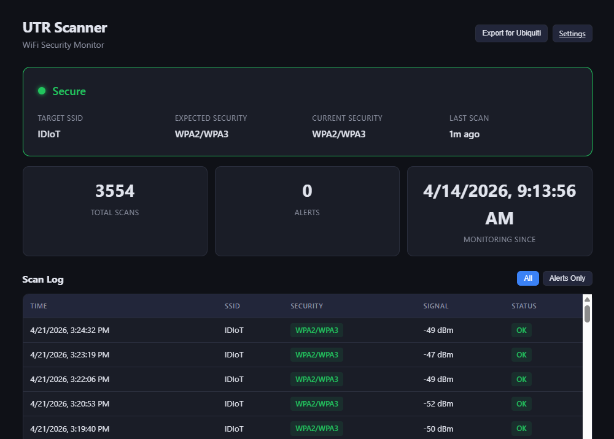

# UTR Scanner - WiFi Security Monitor

A lightweight Raspberry Pi tool that continuously monitors a WiFi SSID's security level and alerts you if it drops from WPA2/WPA3 to an open or insecure state.



## Why Does This Exist?

There's a [reported bug](https://community.ui.com/questions/UniFi-Travel-Router-Unsecure-WiFi/83fa9d26-d929-4623-aba8-90048eb813fe) in the UniFi Travel Router (UTR) where the device periodically broadcasts a configured WPA2 network as an **open, unsecured network** — giving anyone in range direct access to your home network via the Teleport tunnel.

Multiple users have confirmed the issue. It appears intermittent and difficult to reproduce, which makes it even more dangerous — it seems to happen most often when the UTR is connected to hotel WiFi, not easily reproduced at home. This tool sits next to your UTR and watches for exactly this scenario.

## What It Does

- Scans for your target SSID once per minute (configurable)
- Logs the detected security type (WPA2, WPA3, WEP, Open) with timestamp and signal strength
- Alerts immediately if security drops below expected level
- Provides a web dashboard at `http://<pi-ip>:8585` with live status, scan log, and 24-hour timeline
- Supports alerts via webhook (Slack/Discord), Pushover, or audible beep
- Starts automatically on boot — plug in the Pi and forget about it

## Security Note

The dashboard is intended for use on a trusted local network. It has no authentication — anyone who can reach `http://<pi-ip>:8585` can view the scan data and change the target SSID. Don't expose it to the public internet, and don't run it on untrusted networks (coffee shops, conferences, etc.).

## Requirements

- **Raspberry Pi** (any model with WiFi — tested on Pi 5 with Debian Trixie/Bookworm)
- **Raspberry Pi OS** (Bookworm or later recommended)
- **Python 3.9+** (installed by the setup script if missing)
- **A WiFi adapter** that can scan (the built-in one works fine)

> **Tip:** If you're using the Pi's built-in WiFi for network connectivity, consider adding a USB WiFi adapter dedicated to scanning. This avoids brief connectivity interruptions during scans. If the Pi is on Ethernet, the built-in WiFi works great as a dedicated scanner.

## Quick Install

```bash
git clone https://github.com/Crosstalk-Solutions/utr-scanner.git /opt/utr-scanner
cd /opt/utr-scanner
sudo bash install.sh
```

Then start the service:

```bash
sudo systemctl start utr-scanner
```

Open the dashboard at `http://<your-pi-ip>:8585` and click **Configure SSID** to select the network you want to monitor.

That's it. The scanner will run on every boot automatically.

## Web-Based Setup

On first launch, the dashboard will prompt you to configure your target SSID. Click **Settings** (or navigate to `http://<pi-ip>:8585/setup`) to:

1. **Scan for nearby networks** — the Pi scans for all visible SSIDs and shows them with signal strength and current security type
2. **Select your network** — click the SSID you want to monitor, or type it manually
3. **Set expected security** — choose WPA2, WPA3, or WPA2/WPA3
4. **Save** — settings are applied immediately, no restart needed

Settings persist across reboots.

## Manual Configuration

You can also edit the config file directly:

```bash
sudo nano /etc/utr-scanner/config.yaml
```

```yaml
target_ssid: "MyNetwork"        # The SSID to monitor
expected_security: "WPA2"       # Expected: WPA2, WPA3, WPA2/WPA3
scan_interval: 60               # Seconds between scans
wifi_interface: "wlan0"         # WiFi adapter to use

web:
  host: "0.0.0.0"
  port: 8585

alerts:
  beep: true
  # webhook_url: "https://hooks.slack.com/services/YOUR/WEBHOOK/URL"
  # pushover:
  #   user_key: "your-user-key"
  #   api_token: "your-api-token"
```

After editing, restart the service:

```bash
sudo systemctl restart utr-scanner
```

## Dashboard

The web dashboard at `http://<pi-ip>:8585` shows:

- **Live status** — green when secure, red with a pulsing alert when insecure
- **Scan log** — timestamped history of every scan with security type and signal strength, filterable to alerts only
- **24-hour timeline** — visual bar showing security state over time (green = secure, red = insecure, yellow = SSID not found)
- **Active alerts** — dismissable alerts when an insecure state is detected

The dashboard auto-refreshes every 10 seconds.

## Managing the Service

```bash
sudo systemctl start utr-scanner    # Start
sudo systemctl stop utr-scanner     # Stop
sudo systemctl restart utr-scanner  # Restart
sudo systemctl status utr-scanner   # Status
sudo journalctl -u utr-scanner -f   # Live logs
```

## How It Works

1. The scanner runs `iw dev wlan0 scan` on the configured interval (default: 60 seconds)
2. It parses the scan output to determine each network's security type (RSN = WPA2, SAE = WPA3, etc.)
3. It looks for the target SSID and compares the detected security against the expected level
4. Every scan is logged to a local SQLite database with timestamp, security type, and signal strength
5. If security doesn't match (Open, WEP, or downgraded) — alerts fire immediately

The scanner handles common Raspberry Pi quirks automatically:
- **RF-kill** — WiFi is often soft-blocked after boot; the scanner unblocks it
- **Interface down** — wlan0 starts in DOWN state; the scanner brings it up and waits for it to be ready
- **`iw` path** — found at `/usr/sbin/iw` on Pi OS, auto-discovered

## Uninstall

```bash
sudo bash /opt/utr-scanner/uninstall.sh
```

## License

MIT
